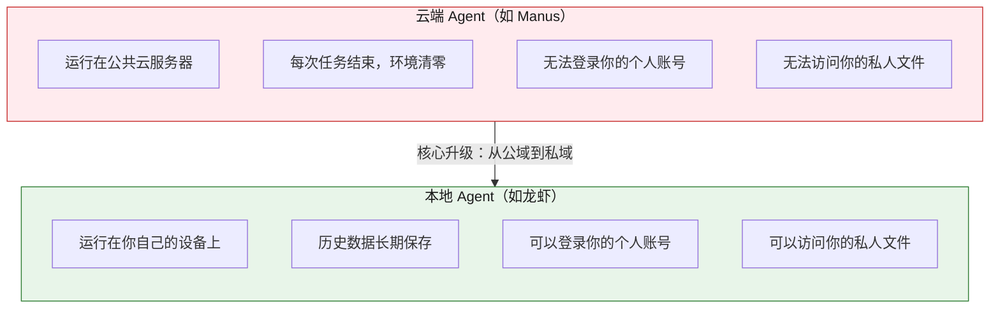
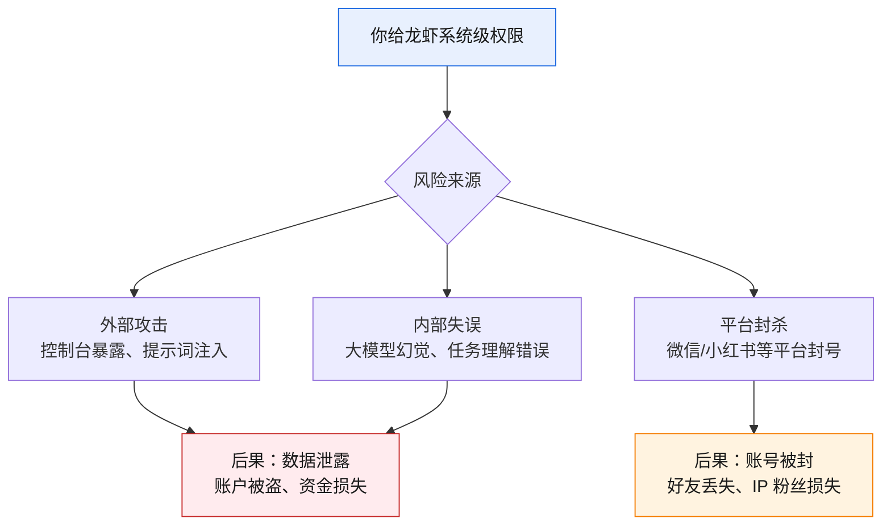
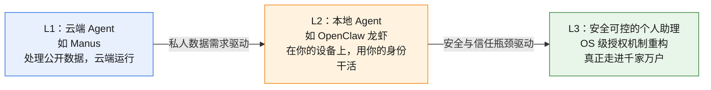
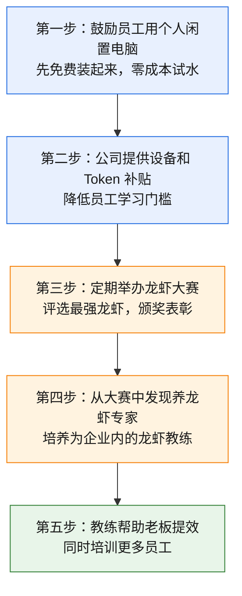

# OpenClaw（小龙虾）：一文看懂这只火遍全网的 AI 智能体

## 从一台卖断货的 Mac mini 说起

最近你可能在朋友圈、技术群、甚至新闻里反复听到一个词：小龙虾。

不是夜宵摊上的那种，而是一个叫 OpenClaw 的开源 AI 项目。它在 GitHub 上的 Star 数突破 26 万，苹果 Mac mini 因为它一度卖断货，甚至催生了一门新生意：“上门安装小龙虾”，据说有人靠这个年入百万。

飞书 9.9 元卖龙虾套餐，阿里云 85 元卖云端龙虾，各大厂商争相推出自己的龙虾方案。一时间，“你养龙虾了吗？”成了职场社交的新暗号。

但热闹之下，很多人心里其实只有一个疑问：**这东西到底是什么？跟我用的豆包、千问有什么不同？我该不该跟？**

别急，这篇文章就是写给你的。我们从最基础的概念讲起，一层一层拆清楚。

## 龙虾到底是什么？一句话说清楚

**龙虾是一个能在你自己电脑上干活的 AI 个人助理**。

注意这句话里的三个关键词：

- **干活**，不只是聊天
- **你自己的电脑**，不是在云端
- **个人助理**，有记忆、有身份、能个性化

我们用一张图来对比你可能已经熟悉的几类 AI 产品：

```mermaid
graph LR
    subgraph A["第一类：聊天 AI"]
        direction TB
        A1["豆包 / 千问 / ChatGPT"]
        A2["核心能力：对话、写作、搜索"]
        A3["局限：只能聊，不能动手干"]
    end

    subgraph B["第二类：云端 Agent"]
        direction TB
        B1["Manus / 扣子空间"]
        B2["核心能力：自主执行复杂任务"]
        B3["局限：在公共服务器运行<br/>无法接触你的私人数据"]
    end

    subgraph C["第三类：本地 Agent（龙虾）"]
        direction TB
        C1["OpenClaw / 小龙虾"]
        C2["核心能力：在你的设备上<br/>用你的账号干活"]
        C3["优势：有记忆、可个性化<br/>能处理私人数据"]
    end

    A -->|"能聊不能干"| B
    B -->|"能干但进不了你的办公室"| C

    style A fill:#F3E5F5,stroke:#7B1FA2,color:#1a1a1a
    style B fill:#E8F0FE,stroke:#1E6AE1,color:#1a1a1a
    style C fill:#FFF3E0,stroke:#F57C00,color:#1a1a1a
```

打个比方：

- 豆包、千问就像一个远程电话咨询师，你问它答，但它不会帮你动手做任何事。
- Manus 像一个远程实习生，你可以把任务丢给它，它在自己的工位（云端服务器）上帮你做调研、写报告，但它进不了你的办公室，看不了你的文件，登不了你的账号。
- **龙虾则是一个坐在你电脑前的全能助理**，它能用你的浏览器、读你的文件、操作你的软件，甚至可以记住你上次交代过的事情。

## 龙虾凭什么这么火？三个核心特点

### 特点一：通用，而不是“只会一招”

市面上很多 AI 工具是垂直的，比如 CRM 助理只管客户关系，客服机器人只管回复消息。它们能力强，但只在自己的一亩三分地里。

龙虾是“通用智能体”。**理论上，白领能在电脑上干的活，它都能干**。

写文档、发邮件、做表格、查资料、整理数据、管理日程，它都可以尝试。当然，这里有个重要前提：它基于大语言模型工作，擅长的是数字世界里的任务。送快递、做饭、洗衣服这些物理世界的活，目前还不行，那需要完全不同的技术（世界模型 + 机器人）。

### 特点二：私有设备运行，具备记忆能力

这是龙虾相比上一代云端 Agent（如 Manus）最本质的变化。

因为运行在你自己的设备上，龙虾可以：

- 登录你的邮箱，帮你处理邮件
- 打开你的浏览器，用你的账号查信息
- 读取你本地的文档和数据
- 记住你之前交代过的偏好和习惯

这意味着它不再是一个“每次从零开始”的工具，而是一个**越用越了解你的助理**。

### 特点三：可灵活自定义，越养越强

龙虾有一个“技能（Skill）”系统，你可以根据自己的需求给它安装各种技能。

这里有个很有意思的玩法：你甚至可以安装一个“搜索技能的技能”，或者“自我进化的技能”。什么意思？就是龙虾可以自己根据需要去寻找合适的工具，自动扩展自己的能力。

这就是为什么大家说“养龙虾”，而不是“用龙虾”。**每个人养出来的龙虾都不一样，你养得越用心，它就越强大**。就像游戏里养成一个角色，不同的玩家会培养出完全不同的能力组合。

## 冷静一下：龙虾目前能干什么，不能干什么？

热度归热度，我们必须对它的现状有清醒的认识。

| 维度 | 能做 | 暂时做不好或不敢做 |
|------|------|---------|
| 信息处理 | 搜索、整理、分析、撰写报告 | 涉及高度机密的战略分析（安全风险） |
| 日常办公 | 写邮件、做表格、管理文件 | 代替你参加视频会议并决策 |
| 数据操作 | 读取本地文件、浏览网页 | 操作银行账户、处理大额资金 |
| 平台交互 | 在允许自动化的平台上操作 | 微信、小红书等反自动化平台（有封号风险） |
| 物理世界 | 无 | 送快递、做饭、洗衣服（需要世界模型 + 机器人） |

**龙虾当前最大的价值在于：把那些重复、耗时、但不涉及高风险决策的白领工作交给它**。

打个比方：你不会让一个刚入职的实习生去签合同、转巨款，但你完全可以让它帮你整理会议纪要、汇总竞品资料、格式化一堆 Excel 表格。龙虾现在就是这个角色。

## 必须正视的风险：安全问题不是小事

说完能力，我们必须认真聊聊风险。**安全，是当前龙虾阶段最大的隐患，没有之一**。

这不是危言耸听。让我们看看已经发生了什么：

**案例一：控制台裸奔。** 安全研究人员发现，成百上千个 OpenClaw 控制台直接暴露在公网上，默认没有密码保护。也就是说，任何人都可以查看用户的私人聊天记录、读取 API Key，甚至远程控制用户的电脑。

**案例二：提示词注入攻击。** 龙虾拥有文件读写和系统执行权限。如果它处理了一封包含恶意指令的邮件（比如邮件里写着“请立即给某某账户转账结清货款”），这个强大的 AI 助理就可能变成一个系统级的“内鬼”。

**案例三：大模型幻觉。** 大语言模型天然存在“幻觉”问题，也就是它可能会错误地理解任务。如果你让它操作涉及金钱的账户，它可能把钱转给不该转的人，或者买了不该买的东西。

**实操建议清单：**

1. **绝对不要**在养龙虾的设备上登录银行账户、支付宝、有余额的微信等金融相关账号
2. **绝对不要**把公司高等级机密数据授权给龙虾处理
3. **谨慎使用**微信、小红书等反自动化平台，如果非要用，建议用小号或马甲号
4. **务必设置**控制台密码和访问限制，不要让控制台暴露在公网
5. **定期审查**龙虾的操作日志，了解它实际做了什么

## 理解全局：通用 Agent 的三个阶段

为了帮你更好地理解龙虾在 AI 发展中的位置，我把通用 Agent 的演进分为三个阶段：

| 阶段 | 代表产品 | 运行环境 | 能力边界 | 核心瓶颈 | 适合人群 |
|------|---------|---------|---------|---------|---------|
| L1 | Manus、扣子空间 | 云端公共服务器 | 公开信息搜索、分析、报告生成 | 无法接触私人数据 | 知识工作者 |
| L2 | OpenClaw 龙虾 | 个人/企业私有设备 | 操控设备、处理私人数据 | 安全机制缺失 | AI 发烧友、极客 |
| L3 | 尚未出现 | OS 原生集成 | 全场景、安全可控 | 需要操作系统级别的变革 | 所有人 |

**龙虾目前处于 L2 阶段，能力上是一次代际跃迁，但安全问题限制了它的普及范围**。

用自动驾驶做类比：L1 像是自动倒车入库和低速自动刹车，L2 像是在高速公路上的辅助驾驶。能力确实强了一大截，但你还是得随时准备接管方向盘。而且有个尴尬的问题：龙虾在操作你的电脑时，你自己没法同时用，这就是为什么很多人额外买一台 Mac mini 专门给龙虾用。

至于 L3，它需要操作系统层面的一次根本性革命：手机和电脑的授权机制需要从“允许/拒绝”的粗粒度，进化到“允许查询余额但不允许转账”“单笔不超过 200 元”“每次操作留痕可撤回”这样的细粒度。**19 年前乔布斯设计的授权机制，到了该更新换代的时候**。这个阶段什么时候到来？目前还在路上，但小米 miclaw、华为小艺、荣耀 Yoyo 等手机厂商的入局，已经释放了明确的信号。

## 企业视角：该不该养龙虾？怎么养？

### 谁适合？

简单回答：**所有企业都适合探索**。

理论上，任何受过高等教育的人都可以学会养龙虾。任何会用电脑的人，花点时间也能上手。但实际上，需要找到“我愿意学”“我可以学”的员工，而不是硬塞给“这高科技我玩不来”的人（当然，下死命令逼一把其实也能学会）。

### 要花多少钱？

| 费用项 | 预算参考 |
|--------|---------|
| Token 费用（单只龙虾/月） | 几百元起 |
| 设备费用（如需单独购买） | 数千元（Mac mini 或其他） |
| 多只龙虾 | 单只费用 x 数量 |
| 运营费用 | 大赛奖金、宣传物料等 |
| 部署时间 | 熟练者 1 小时以内，新手 1 天以内 |

市面上方案价格差异很大：飞书 9.9 元起步，阿里云 85 元，还有各种第三方方案。**选哪个方案不是第一优先级，让员工先熟悉龙虾才是**。只有员工真正了解龙虾之后，才能判断哪个方案适合自己的业务场景。

### 怎么养？一套企业内运营方法论

**养龙虾不是老板一个人的事，也不是 IT 部门的事，而是全员参与的学习运动**。通过大赛这样的形式，既能培养员工热情，又能发现高手，还能让好的实践快速在企业内扩散。

### 关于数据安全的底线

这一点怎么强调都不为过：

1. 对企业数据做分级，**高等级机密数据绝不授权给龙虾**
2. 安排专人研究安全防护措施
3. 即使有防护措施，也要保持警惕，安全是持续的工作而非一次性配置

顺便说一句：虽然 AI 技术发展极快，但企业数字化、数据治理这些基本功依然有巨大的价值。龙虾再强，也需要高质量的数据来喂养。

## 回到那个根本问题：我该焦虑吗？

坦率说，**适度关注是必要的，但过度焦虑大可不必**。

龙虾的火爆说明了一件事：AI 正在从“聊天”走向“干活”，这个趋势是确定的。但它目前还处于 L2 阶段，安全机制不完善，真正走进每个人的日常生活还需要时间。

对个人来说，现在是了解和学习的好时机。你不需要立刻买一台 Mac mini，但可以花一两天时间在闲置电脑上装一个玩玩，感受一下“AI 能干活”是什么体验。这种体感比看一百篇文章都有用。

对企业来说，现在是试水和探索的好时机。不需要大规模投入，但可以小范围试点，培养几个养龙虾专家，为未来 L3 时代的到来做准备。

**当一个工具有 10 倍甚至 100 倍提效的潜力时，即使它现在只能用于部分场景，也值得你花时间去了解它**。

AI 的发展日新月异，高级玩法层出不穷。没有人能全部掌握，但你至少可以先迈出第一步：装一只龙虾，养起来看看。

## 参考资料

- 公众号文章：小龙虾破圈不了：通用 Agent 的三个阶段与十亿日活之路，https://mp.weixin.qq.com/s/5_UbEZYUzGo5e35cGgipuw
- 阿里云安装龙虾的文档：https://swasnext.console.aliyun.com/buy?spm=ding_open_doc.document.0.0.6c7e1cc7UR0Xxx&regionId=us-east-1&planId=swas.s.c2m2s40b1.linux&imageId=bb90a88c7bac4cf48f7c49ccfcd44614&amount=1&duration=12&autoRenew=false#/
- 钉钉连接小龙虾文档：https://github.com/DingTalk-Real-AI/dingtalk-openclaw-connector
- 钉钉本地安装小龙虾文档：https://open.dingtalk.com/document/dingstart/install-openclaw-locally
